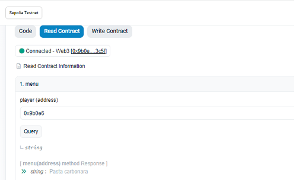

## About the project

This is a Solidity hybrid contract that uses a [Chainlink VRF](https://docs.chain.link/vrf#overview) (Verifiable Random Function), deployed with Foundry. This is a learning project which purpose is to use an oracle to get a random value.

The contract will randomly output 1 of 14 meals stored within the contract.



## Getting started

To test its functionality check the contract on [sepolia.etherscan](https://sepolia.etherscan.io/address/0x273cbb39fccbe173fb9514b9ac6498613948bdeb)

1. Go to Contract section, connect to your wallet.
2. In Write Contract, call _rollDice_ function by passing your wallet address. The contract needs some time to request randomness, allow 2-3 minutes for this.
3. In Read Contract, call _menu_ function. Enter the same wallet address to get the result.

Requesting randomness is based on ChainlinkVRF subscription method. Some LINK were funded to the current contract, but once enough random values are requested it will stop to respond.

## Requirements

- [Install Foundry](https://getfoundry.sh/)

- [VRF Subscription](https://docs.chain.link/vrf/v2/subscription): VRF v2 requests receive funding from subscription accounts.
  [Create your subscription](https://vrf.chain.link/). The subscription ID is also needed for the script file. Fund the subscription with 10 LINK.

## Quickstart

```
git clone https://github.com/marina-ciuperca/foundry-LunchBox
cd foundry-LunchBox
forge build
```

## Deployment to a testnet

### Script

Add the subscription ID to your script as a parameter.

Setup environment variables :
You will need to setup RPC_URL and a PRIVATE_KEY as environment variables.
Additionally add [ETHERSCAN_API_KEY](https://docs.etherscan.io/getting-started/viewing-api-usage-statistics) for verification on Etherscan.

Deploy :

```
forge script script/LunchBoxDeploy.s.sol --rpc-url $RPC_URL --private-key $PRIVATE_KEY --broadcast --verify --etherscan-api-key $ETHERSCAN_API_KEY
```

## Acknowledgments

🚀 This course was created as part of my Solidity learning path. Huge thanks to [Patrick Collins](https://github.com/Cyfrin) for his teaching generosity and inspiration.
